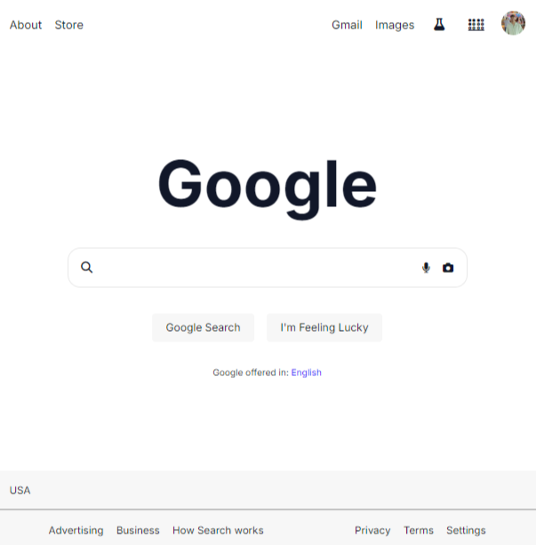

# Google Home Page Replica

This project is a replica of the Google Home Page created using only HTML and CSS. It demonstrates the ability to recreate popular web pages using basic web development technologies.

## Project Overview

The aim of this project is to replicate the minimalist design and layout of the Google Home Page. This includes:

- The Google logo
- Search bar with input field and buttons
- Navigation links
- Footer with additional links

## Technologies Used

- **HTML5:** Used for the structure of the webpage.
- **CSS3:** Used for styling the webpage to match the Google Home Page design.

## Features

- Responsive design that adjusts to different screen sizes.
- Accurate layout and design elements to mimic the original Google Home Page.

## Setup and Usage

To view the Google Home Page Replica:

1. Clone this repository to your local machine:
    ```bash
    git clone https://github.com/alvinjuan/Google-Home-Page-Replica.git
    ```
2. Navigate to the project directory:
    ```bash
    cd Google-Home-Page-Replica
    ```
3. Open the `index.html` file in your preferred web browser.

## Screenshot



## License

This project is licensed under the MIT License. See the [LICENSE](LICENSE) file for more details.

---

You can replace `path-to-screenshot.png` with the actual path if you include a screenshot in the repository.
